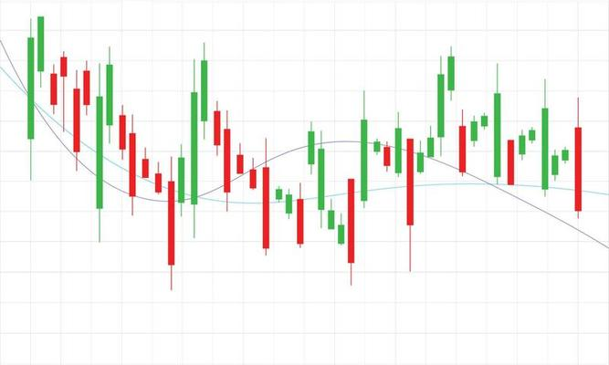

<p align="center"></p>
<p align="center"><h1 align="center">Backtest Replay</h1></p>
<p align="center">
	<em><code>❯ Backtest popular trading strategies with real-time ingestion</code></em>
</p>
<p align="center">
	
	
	
</p>
<p align="center"><!-- default option, no dependency badges. -->
</p>
<p align="center">
	<!-- default option, no dependency badges. -->
</p>
<br>

##  Table of Contents

- [ Overview](#overview)
- [ Features](#features)
- [ Demo](#demo)
- [ Getting Started](#getting-started)
  - [ Prerequisites](#prerequisites)
  - [ Installation](#installation)
  - [ Usage](#usage)
- [ Future Improvements](#future-improvements)
- [ License](#license)


##  Overview

Backtesting is the most important aspect of trading strategy development- the best way to predict the future is given past data. Using historical data, Backtesting engines like this one can operate giving a retroactive view into how well a particular strategy could have performed if actually executed in the past. As an extension into this idea, it would be neat to see how strategies profit in a real-time manner, being able to see the result of new ticks daily on overall position and ending cash. This project does that- we provide a mock stream of real OHLC (Daily open/high/low/close) data to the strategy, and we can view the results after every tick.

## Technical Process

The `Python` app, made with `Flask`, requires inputs to track the historical data of a particular security, given a date range. Using a seperate Producer process, this data is fetched from `Polygon.io`, noting that the API does have data limits based on the subscription tier. The Producer then submits this data into an `Apache Kafka` stream, day by day at a particular user-defined rate (although 1hz works best). An `Apache Spark Structured Streaming` job subscribes to this Kafka topic and reads new entries periodically, which simulates the real-time-ness of the data. This new data is then processed based on a particular strategy, and relevant strategy parameters. Finally, it is displayed, with strategy parameters (e.g. moving averages) overlayed on the ticks, to visually represent how the strategy works and performs.

## Overview of Strategies

### Simple Moving Average Crossover


### Exponential Moving Average Crossover


### RSI


##  Features

Backend built with:
- Python 3.10
- Apache Kafka
- Apache Spark (Structured Streaming)
- Polygon.io

Frontend built with:
- Flask (web framework)
- Dash (Plotly)

## Demo

Below is a working demo of the frontend, and backend.

https://github.com/user-attachments/assets/05d503e1-6ef3-4694-836e-b4811ce0fd06

##  Getting Started

###  Prerequisites

Before getting started with this project, ensure your runtime environment meets the following requirements:

- **Programming Language:** Python 3.10+
- **Package Manager:** pip

###  Installation

**Build from source:**

1. Clone the Backtest repository:
```sh
git clone https://github.com/twilkhoo/Backtest
```

2. Navigate to the project directory:

```sh
cd Backtest
```

3. Install the project dependencies:

```sh
sudo apt update
sudo apt install -y openjdk-11-jdk python3 python3-venv python3-pip wget tar
```

###  Usage
Start Zookeeper and Kafka (each in its own terminal)

```
cd kafka && bin/zookeeper-server-start.sh config/zookeeper.properties
cd kafka && bin/kafka-server-start.sh config/server.properties
```

Create a new Kafka topic
```
cd kafka
bin/kafka-topics.sh --create --topic ohlcv --bootstrap-server localhost:9092 --partitions 1 --replication-factor 1
```

Create and activate venv
```
cd ~
python3 -m venv spark-kafka-env
source spark-kafka-env/bin/activate
pip install --upgrade pip
pip install -r requirements.txt
```

Run the Flask UI (which will automatically start up the consumer, and invoke the producer when details are submitted)
```
python app3.py
```

Deleting a topic (for testing)
```
bin/kafka-topics.sh --bootstrap-server localhost:9092 --delete --topic <topic_name>
bin/kafka-topics.sh --bootstrap-server localhost:9092 --list
```

Stopping ZooKeeper
```
bin/zookeeper-server-stop.sh
```

##  Future Improvements

- Right now, the form of creating strategies isn't very extensible. I'm essentially writing each one from scratch, loosely following the general pattern that each strategy needs to operate on the entire timeseries dataframe, and return a dash figure (chart). [Backtesting.py](https://kernc.github.io/backtesting.py/) has a much more extensible API- define a class, constructor, and next function (like an iterator) to consume one piece of data (like a tick) and adjust its parameters this way.

##  License

This project is protected under the [MIT](https://choosealicense.com/licenses/mit/) License. For more details, refer to the [LICENSE](https://choosealicense.com/licenses/mit/) file.
